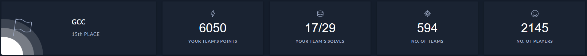

# HTB University CTF 2021 - Write-ups

During the Qualifications for University CTF 2021, organized by [HackTheBox](https://hackthebox.com/), we managed to reach the 15th place out of nearly 600 teams and qualified for the final phase !

Thanks to my mates from the [GCC team](https://twitter.com/gcc_ensibs), which is the [ENSIBS](https://www-ensibs.univ-ubs.fr) cybersecurity club's team.

|     Phase      |  Category |              Challenge               |
|----------------|-----------|--------------------------------------|
| Qualifications | reversing | [Upgrades](Upgrades)                 |
| Qualifications | reversing | [The vault](The_vault)               |
| Qualifications | pwn       | [Arachnoid Heaven](Arachnoid_heaven) |
| Qualifications | pwn       | [Robot factory](Robot_factory)       |
